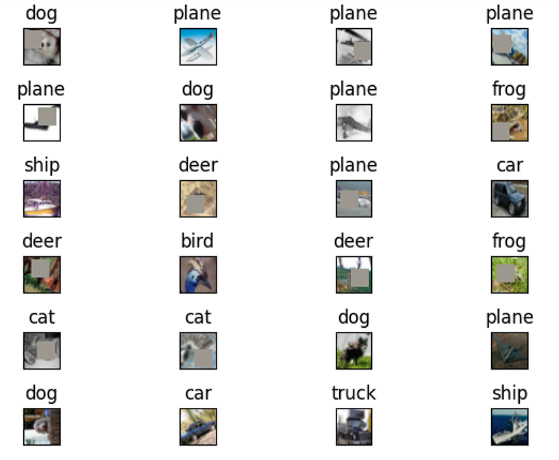

# Objective

Write a new network that
- has the architecture to C1C2C3C40 (No MaxPooling, but 3 convolutions, where the last one has a stride of 2 instead) (If you can figure out how to use Dilated kernels here instead of MP or strided convolution, then 200pts extra!)
- total RF must be more than 44
- one of the layers must use Depthwise Separable Convolution
- one of the layers must use Dilated Convolution
- use GAP (compulsory):- add FC after GAP to target #of classes (optional)
- use albumentation library and apply:
    - horizontal flip
    - shiftScaleRotate
    - coarseDropout (max_holes = 1, max_height=16px, max_width=16, min_holes = 1, min_height=16px, min_width=16px, fill_value=(mean of your dataset), mask_fill_value = None)

- achieve 85% accuracy, as many epochs as you want. Total Params to be less than 200k(2,00,000 params)


# Results

## Cutout Implementation



## Model

```ruby
==========================================================================================
Layer (type:depth-idx)                   Output Shape              Param #
==========================================================================================
Net                                      [1, 10]                   --
├─ConvLayer: 1-1                         [1, 8, 32, 32]            --
│    └─Sequential: 2-1                   [1, 8, 32, 32]            --
│    │    └─Conv2d: 3-1                  [1, 8, 32, 32]            216
│    │    └─BatchNorm2d: 3-2             [1, 8, 32, 32]            16
│    │    └─ReLU: 3-3                    [1, 8, 32, 32]            --
│    │    └─Dropout2d: 3-4               [1, 8, 32, 32]            --
├─DepthwiseConvLayer: 1-2                [1, 16, 32, 32]           --
│    └─Sequential: 2-2                   [1, 16, 32, 32]           --
│    │    └─Conv2d: 3-5                  [1, 8, 32, 32]            72
│    │    └─Conv2d: 3-6                  [1, 16, 32, 32]           128
│    │    └─ReLU: 3-7                    [1, 16, 32, 32]           --
│    │    └─BatchNorm2d: 3-8             [1, 16, 32, 32]           32
│    │    └─Dropout2d: 3-9               [1, 16, 32, 32]           --
├─ConvLayer: 1-3                         [1, 16, 32, 32]           --
│    └─Sequential: 2-3                   [1, 16, 32, 32]           --
│    │    └─Conv2d: 3-10                 [1, 16, 32, 32]           1,152
│    │    └─BatchNorm2d: 3-11            [1, 16, 32, 32]           32
│    │    └─ReLU: 3-12                   [1, 16, 32, 32]           --
│    │    └─Dropout2d: 3-13              [1, 16, 32, 32]           --
├─ConvLayer: 1-4                         [1, 16, 32, 32]           --
│    └─Sequential: 2-4                   [1, 16, 32, 32]           --
│    │    └─Conv2d: 3-14                 [1, 16, 32, 32]           1,152
│    │    └─BatchNorm2d: 3-15            [1, 16, 32, 32]           32
│    │    └─ReLU: 3-16                   [1, 16, 32, 32]           --
│    │    └─Dropout2d: 3-17              [1, 16, 32, 32]           --
├─DepthwiseConvLayer: 1-5                [1, 32, 32, 32]           --
│    └─Sequential: 2-5                   [1, 32, 32, 32]           --
│    │    └─Conv2d: 3-18                 [1, 16, 32, 32]           144
│    │    └─Conv2d: 3-19                 [1, 32, 32, 32]           512
│    │    └─ReLU: 3-20                   [1, 32, 32, 32]           --
│    │    └─BatchNorm2d: 3-21            [1, 32, 32, 32]           64
│    │    └─Dropout2d: 3-22              [1, 32, 32, 32]           --
├─ConvLayer: 1-6                         [1, 32, 32, 32]           --
│    └─Sequential: 2-6                   [1, 32, 32, 32]           --
│    │    └─Conv2d: 3-23                 [1, 32, 32, 32]           4,608
│    │    └─BatchNorm2d: 3-24            [1, 32, 32, 32]           64
│    │    └─ReLU: 3-25                   [1, 32, 32, 32]           --
│    │    └─Dropout2d: 3-26              [1, 32, 32, 32]           --
├─ConvLayer: 1-7                         [1, 32, 32, 32]           --
│    └─Sequential: 2-7                   [1, 32, 32, 32]           --
│    │    └─Conv2d: 3-27                 [1, 32, 32, 32]           4,608
│    │    └─BatchNorm2d: 3-28            [1, 32, 32, 32]           64
│    │    └─ReLU: 3-29                   [1, 32, 32, 32]           --
│    │    └─Dropout2d: 3-30              [1, 32, 32, 32]           --
├─TransBlock: 1-8                        [1, 16, 16, 16]           --
│    └─Sequential: 2-8                   [1, 16, 16, 16]           --
│    │    └─Conv2d: 3-31                 [1, 16, 16, 16]           896
├─ConvLayer: 1-9                         [1, 32, 16, 16]           --
│    └─Sequential: 2-9                   [1, 32, 16, 16]           --
│    │    └─Conv2d: 3-32                 [1, 32, 16, 16]           4,608
│    │    └─BatchNorm2d: 3-33            [1, 32, 16, 16]           64
│    │    └─ReLU: 3-34                   [1, 32, 16, 16]           --
│    │    └─Dropout2d: 3-35              [1, 32, 16, 16]           --
├─ConvLayer: 1-10                        [1, 48, 16, 16]           --
│    └─Sequential: 2-10                  [1, 48, 16, 16]           --
│    │    └─Conv2d: 3-36                 [1, 48, 16, 16]           13,824
│    │    └─BatchNorm2d: 3-37            [1, 48, 16, 16]           96
│    │    └─ReLU: 3-38                   [1, 48, 16, 16]           --
│    │    └─Dropout2d: 3-39              [1, 48, 16, 16]           --
├─DepthwiseConvLayer: 1-11               [1, 48, 16, 16]           --
│    └─Sequential: 2-11                  [1, 48, 16, 16]           --
│    │    └─Conv2d: 3-40                 [1, 32, 16, 16]           288
│    │    └─Conv2d: 3-41                 [1, 48, 16, 16]           1,536
│    │    └─ReLU: 3-42                   [1, 48, 16, 16]           --
│    │    └─BatchNorm2d: 3-43            [1, 48, 16, 16]           96
│    │    └─Dropout2d: 3-44              [1, 48, 16, 16]           --
├─ConvLayer: 1-12                        [1, 48, 16, 16]           --
│    └─Sequential: 2-12                  [1, 48, 16, 16]           --
│    │    └─Conv2d: 3-45                 [1, 48, 16, 16]           13,824
│    │    └─BatchNorm2d: 3-46            [1, 48, 16, 16]           96
│    │    └─ReLU: 3-47                   [1, 48, 16, 16]           --
│    │    └─Dropout2d: 3-48              [1, 48, 16, 16]           --
├─ConvLayer: 1-13                        [1, 56, 16, 16]           --
│    └─Sequential: 2-13                  [1, 56, 16, 16]           --
│    │    └─Conv2d: 3-49                 [1, 56, 16, 16]           24,192
│    │    └─BatchNorm2d: 3-50            [1, 56, 16, 16]           112
│    │    └─ReLU: 3-51                   [1, 56, 16, 16]           --
│    │    └─Dropout2d: 3-52              [1, 56, 16, 16]           --
├─DepthwiseConvLayer: 1-14               [1, 56, 16, 16]           --
│    └─Sequential: 2-14                  [1, 56, 16, 16]           --
│    │    └─Conv2d: 3-53                 [1, 48, 16, 16]           432
│    │    └─Conv2d: 3-54                 [1, 56, 16, 16]           2,688
│    │    └─ReLU: 3-55                   [1, 56, 16, 16]           --
│    │    └─BatchNorm2d: 3-56            [1, 56, 16, 16]           112
│    │    └─Dropout2d: 3-57              [1, 56, 16, 16]           --
├─ConvLayer: 1-15                        [1, 56, 16, 16]           --
│    └─Sequential: 2-15                  [1, 56, 16, 16]           --
│    │    └─Conv2d: 3-58                 [1, 56, 16, 16]           24,192
│    │    └─BatchNorm2d: 3-59            [1, 56, 16, 16]           112
│    │    └─ReLU: 3-60                   [1, 56, 16, 16]           --
│    │    └─Dropout2d: 3-61              [1, 56, 16, 16]           --
├─TransBlock: 1-16                       [1, 24, 8, 8]             --
│    └─Sequential: 2-16                  [1, 24, 8, 8]             --
│    │    └─Conv2d: 3-62                 [1, 24, 8, 8]             3,264
├─ConvLayer: 1-17                        [1, 40, 8, 8]             --
│    └─Sequential: 2-17                  [1, 40, 8, 8]             --
│    │    └─Conv2d: 3-63                 [1, 40, 8, 8]             8,640
│    │    └─BatchNorm2d: 3-64            [1, 40, 8, 8]             80
│    │    └─ReLU: 3-65                   [1, 40, 8, 8]             --
│    │    └─Dropout2d: 3-66              [1, 40, 8, 8]             --
├─ConvLayer: 1-18                        [1, 48, 8, 8]             --
│    └─Sequential: 2-18                  [1, 48, 8, 8]             --
│    │    └─Conv2d: 3-67                 [1, 48, 8, 8]             17,280
│    │    └─BatchNorm2d: 3-68            [1, 48, 8, 8]             96
│    │    └─ReLU: 3-69                   [1, 48, 8, 8]             --
│    │    └─Dropout2d: 3-70              [1, 48, 8, 8]             --
├─DepthwiseConvLayer: 1-19               [1, 48, 8, 8]             --
│    └─Sequential: 2-19                  [1, 48, 8, 8]             --
│    │    └─Conv2d: 3-71                 [1, 40, 8, 8]             360
│    │    └─Conv2d: 3-72                 [1, 48, 8, 8]             1,920
│    │    └─ReLU: 3-73                   [1, 48, 8, 8]             --
│    │    └─BatchNorm2d: 3-74            [1, 48, 8, 8]             96
│    │    └─Dropout2d: 3-75              [1, 48, 8, 8]             --
├─ConvLayer: 1-20                        [1, 48, 8, 8]             --
│    └─Sequential: 2-20                  [1, 48, 8, 8]             --
│    │    └─Conv2d: 3-76                 [1, 48, 8, 8]             17,280
│    │    └─BatchNorm2d: 3-77            [1, 48, 8, 8]             96
│    │    └─ReLU: 3-78                   [1, 48, 8, 8]             --
│    │    └─Dropout2d: 3-79              [1, 48, 8, 8]             --
├─ConvLayer: 1-21                        [1, 48, 8, 8]             --
│    └─Sequential: 2-21                  [1, 48, 8, 8]             --
│    │    └─Conv2d: 3-80                 [1, 48, 8, 8]             20,736
│    │    └─BatchNorm2d: 3-81            [1, 48, 8, 8]             96
│    │    └─ReLU: 3-82                   [1, 48, 8, 8]             --
│    │    └─Dropout2d: 3-83              [1, 48, 8, 8]             --
├─DepthwiseConvLayer: 1-22               [1, 48, 8, 8]             --
│    └─Sequential: 2-22                  [1, 48, 8, 8]             --
│    │    └─Conv2d: 3-84                 [1, 48, 8, 8]             432
│    │    └─Conv2d: 3-85                 [1, 48, 8, 8]             2,304
│    │    └─ReLU: 3-86                   [1, 48, 8, 8]             --
│    │    └─BatchNorm2d: 3-87            [1, 48, 8, 8]             96
│    │    └─Dropout2d: 3-88              [1, 48, 8, 8]             --
├─ConvLayer: 1-23                        [1, 48, 8, 8]             --
│    └─Sequential: 2-23                  [1, 48, 8, 8]             --
│    │    └─Conv2d: 3-89                 [1, 48, 8, 8]             20,736
│    │    └─BatchNorm2d: 3-90            [1, 48, 8, 8]             96
│    │    └─ReLU: 3-91                   [1, 48, 8, 8]             --
│    │    └─Dropout2d: 3-92              [1, 48, 8, 8]             --
├─TransBlock: 1-24                       [1, 40, 8, 8]             --
│    └─Sequential: 2-24                  [1, 40, 8, 8]             --
│    │    └─Conv2d: 3-93                 [1, 40, 8, 8]             3,520
├─TransBlock: 1-25                       [1, 20, 8, 8]             --
│    └─Sequential: 2-25                  [1, 20, 8, 8]             --
│    │    └─Conv2d: 3-94                 [1, 20, 8, 8]             800
├─TransBlock: 1-26                       [1, 10, 8, 8]             --
│    └─Sequential: 2-26                  [1, 10, 8, 8]             --
│    │    └─Conv2d: 3-95                 [1, 10, 8, 8]             200
├─AdaptiveAvgPool2d: 1-27                [1, 10, 1, 1]             --
==========================================================================================
Total params: 198,192
Trainable params: 198,192
Non-trainable params: 0
Total mult-adds (Units.MEGABYTES): 41.27
==========================================================================================
Input size (MB): 0.01
Forward/backward pass size (MB): 4.72
Params size (MB): 0.79
Estimated Total Size (MB): 5.53
==========================================================================================
```


## LOGS for 

Reached 83% accuracy in test_data under 50 epochs

```log
EPOCH = 1 | LR = 0.15 | Loss = 1.54 | Batch = 97 | Accuracy = 33.02: 100%|██| 98/98 [00:42<00:00,  2.33it/s]
Test set: Average loss: 0.0032, Accuracy: 4230/10000 (42.30%)
EPOCH = 2 | LR = 0.15 | Loss = 1.32 | Batch = 97 | Accuracy = 46.39: 100%|██| 98/98 [00:40<00:00,  2.42it/s]
Test set: Average loss: 0.0028, Accuracy: 4817/10000 (48.17%)
EPOCH = 3 | LR = 0.15 | Loss = 1.18 | Batch = 97 | Accuracy = 53.54: 100%|██| 98/98 [00:41<00:00,  2.38it/s]
Test set: Average loss: 0.0022, Accuracy: 6062/10000 (60.62%)
EPOCH = 4 | LR = 0.15 | Loss = 1.06 | Batch = 97 | Accuracy = 59.82: 100%|██| 98/98 [00:41<00:00,  2.37it/s]
Test set: Average loss: 0.0019, Accuracy: 6613/10000 (66.13%)
EPOCH = 5 | LR = 0.15 | Loss = 1.10 | Batch = 97 | Accuracy = 63.44: 100%|██| 98/98 [00:41<00:00,  2.38it/s]
Test set: Average loss: 0.0018, Accuracy: 6680/10000 (66.80%)
EPOCH = 6 | LR = 0.15 | Loss = 0.84 | Batch = 97 | Accuracy = 66.15: 100%|██| 98/98 [00:41<00:00,  2.38it/s]
Test set: Average loss: 0.0018, Accuracy: 6840/10000 (68.40%)
EPOCH = 7 | LR = 0.15 | Loss = 0.88 | Batch = 97 | Accuracy = 68.48: 100%|██| 98/98 [00:41<00:00,  2.37it/s]
Test set: Average loss: 0.0016, Accuracy: 7255/10000 (72.55%)
EPOCH = 8 | LR = 0.15 | Loss = 0.93 | Batch = 97 | Accuracy = 70.30: 100%|██| 98/98 [00:41<00:00,  2.34it/s]
Test set: Average loss: 0.0016, Accuracy: 7245/10000 (72.45%)
EPOCH = 9 | LR = 0.15 | Loss = 0.85 | Batch = 97 | Accuracy = 71.87: 100%|██| 98/98 [00:42<00:00,  2.30it/s]
Test set: Average loss: 0.0015, Accuracy: 7377/10000 (73.77%)
EPOCH = 10 | LR = 0.15 | Loss = 0.85 | Batch = 97 | Accuracy = 73.17: 100%|█| 98/98 [00:41<00:00,  2.37it/s]
Test set: Average loss: 0.0014, Accuracy: 7560/10000 (75.60%)
EPOCH = 11 | LR = 0.15 | Loss = 0.81 | Batch = 97 | Accuracy = 74.31: 100%|█| 98/98 [00:41<00:00,  2.38it/s]
Test set: Average loss: 0.0014, Accuracy: 7668/10000 (76.68%)
EPOCH = 12 | LR = 0.15 | Loss = 0.77 | Batch = 97 | Accuracy = 75.32: 100%|█| 98/98 [00:41<00:00,  2.39it/s]
Test set: Average loss: 0.0014, Accuracy: 7614/10000 (76.14%)
EPOCH = 13 | LR = 0.15 | Loss = 0.82 | Batch = 97 | Accuracy = 76.14: 100%|█| 98/98 [00:41<00:00,  2.37it/s]
Test set: Average loss: 0.0015, Accuracy: 7474/10000 (74.74%)
EPOCH = 14 | LR = 0.15 | Loss = 0.73 | Batch = 97 | Accuracy = 76.75: 100%|█| 98/98 [00:41<00:00,  2.37it/s]
Test set: Average loss: 0.0013, Accuracy: 7790/10000 (77.90%)
EPOCH = 15 | LR = 0.15 | Loss = 0.58 | Batch = 97 | Accuracy = 77.39: 100%|█| 98/98 [00:40<00:00,  2.44it/s]
Test set: Average loss: 0.0013, Accuracy: 7788/10000 (77.88%)
EPOCH = 16 | LR = 0.15 | Loss = 0.63 | Batch = 97 | Accuracy = 78.11: 100%|█| 98/98 [00:39<00:00,  2.45it/s]
Test set: Average loss: 0.0013, Accuracy: 7805/10000 (78.05%)
EPOCH = 17 | LR = 0.15 | Loss = 0.65 | Batch = 97 | Accuracy = 78.75: 100%|█| 98/98 [00:39<00:00,  2.46it/s]
Test set: Average loss: 0.0012, Accuracy: 7874/10000 (78.74%)
EPOCH = 18 | LR = 0.15 | Loss = 0.53 | Batch = 97 | Accuracy = 79.30: 100%|█| 98/98 [00:40<00:00,  2.44it/s]
Test set: Average loss: 0.0012, Accuracy: 7961/10000 (79.61%)
EPOCH = 19 | LR = 0.15 | Loss = 0.65 | Batch = 97 | Accuracy = 79.80: 100%|█| 98/98 [00:40<00:00,  2.44it/s]
Test set: Average loss: 0.0012, Accuracy: 7919/10000 (79.19%)
EPOCH = 20 | LR = 0.15 | Loss = 0.59 | Batch = 97 | Accuracy = 80.14: 100%|█| 98/98 [00:40<00:00,  2.44it/s]
Test set: Average loss: 0.0012, Accuracy: 7962/10000 (79.62%)
EPOCH = 21 | LR = 0.15 | Loss = 0.57 | Batch = 97 | Accuracy = 80.55: 100%|█| 98/98 [00:39<00:00,  2.45it/s]
Test set: Average loss: 0.0012, Accuracy: 7996/10000 (79.96%)
EPOCH = 22 | LR = 0.15 | Loss = 0.60 | Batch = 97 | Accuracy = 81.08: 100%|█| 98/98 [00:40<00:00,  2.41it/s]
Test set: Average loss: 0.0012, Accuracy: 8017/10000 (80.17%)
EPOCH = 23 | LR = 0.15 | Loss = 0.61 | Batch = 97 | Accuracy = 81.49: 100%|█| 98/98 [00:42<00:00,  2.31it/s]
Test set: Average loss: 0.0012, Accuracy: 8016/10000 (80.16%)
EPOCH = 24 | LR = 0.15 | Loss = 0.69 | Batch = 97 | Accuracy = 81.62: 100%|█| 98/98 [00:44<00:00,  2.20it/s]
Test set: Average loss: 0.0011, Accuracy: 8099/10000 (80.99%)
EPOCH = 25 | LR = 0.15 | Loss = 0.58 | Batch = 97 | Accuracy = 81.67: 100%|█| 98/98 [00:43<00:00,  2.24it/s]
Test set: Average loss: 0.0012, Accuracy: 7991/10000 (79.91%)
EPOCH = 26 | LR = 0.15 | Loss = 0.44 | Batch = 97 | Accuracy = 82.35: 100%|█| 98/98 [00:42<00:00,  2.29it/s]
Test set: Average loss: 0.0012, Accuracy: 8015/10000 (80.15%)
EPOCH = 27 | LR = 0.15 | Loss = 0.45 | Batch = 97 | Accuracy = 82.82: 100%|█| 98/98 [00:42<00:00,  2.29it/s]
Test set: Average loss: 0.0012, Accuracy: 8081/10000 (80.81%)
EPOCH = 28 | LR = 0.15 | Loss = 0.52 | Batch = 97 | Accuracy = 82.89: 100%|█| 98/98 [00:40<00:00,  2.41it/s]
Test set: Average loss: 0.0011, Accuracy: 8109/10000 (81.09%)
EPOCH = 29 | LR = 0.015 | Loss = 0.36 | Batch = 97 | Accuracy = 85.43: 100%|█| 98/98 [00:40<00:00,  2.41it/s
Test set: Average loss: 0.0011, Accuracy: 8267/10000 (82.67%)
EPOCH = 30 | LR = 0.015 | Loss = 0.39 | Batch = 97 | Accuracy = 86.03: 100%|█| 98/98 [00:40<00:00,  2.43it/s
Test set: Average loss: 0.0011, Accuracy: 8299/10000 (82.99%)
EPOCH = 31 | LR = 0.015 | Loss = 0.35 | Batch = 97 | Accuracy = 86.28: 100%|█| 98/98 [00:40<00:00,  2.40it/s
Test set: Average loss: 0.0010, Accuracy: 8293/10000 (82.93%)
EPOCH = 32 | LR = 0.015 | Loss = 0.41 | Batch = 97 | Accuracy = 86.52: 100%|█| 98/98 [00:42<00:00,  2.32it/s
Test set: Average loss: 0.0011, Accuracy: 8295/10000 (82.95%)
EPOCH = 33 | LR = 0.015 | Loss = 0.41 | Batch = 97 | Accuracy = 86.91: 100%|█| 98/98 [00:40<00:00,  2.42it/s
Test set: Average loss: 0.0011, Accuracy: 8283/10000 (82.83%)
EPOCH = 34 | LR = 0.015 | Loss = 0.30 | Batch = 97 | Accuracy = 86.89: 100%|█| 98/98 [00:41<00:00,  2.36it/s
Test set: Average loss: 0.0011, Accuracy: 8308/10000 (83.08%)
EPOCH = 35 | LR = 0.015 | Loss = 0.33 | Batch = 97 | Accuracy = 87.01: 100%|█| 98/98 [00:40<00:00,  2.42it/s
Test set: Average loss: 0.0011, Accuracy: 8309/10000 (83.09%)
EPOCH = 36 | LR = 0.0015 | Loss = 0.32 | Batch = 97 | Accuracy = 87.36: 100%|█| 98/98 [00:41<00:00,  2.36it/
Test set: Average loss: 0.0011, Accuracy: 8299/10000 (82.99%)
EPOCH = 37 | LR = 0.0015 | Loss = 0.39 | Batch = 97 | Accuracy = 87.40: 100%|█| 98/98 [00:42<00:00,  2.31it/
Test set: Average loss: 0.0011, Accuracy: 8298/10000 (82.98%)
EPOCH = 38 | LR = 0.0015 | Loss = 0.38 | Batch = 97 | Accuracy = 87.44: 100%|█| 98/98 [00:40<00:00,  2.42it/
Test set: Average loss: 0.0011, Accuracy: 8314/10000 (83.14%)
EPOCH = 39 | LR = 0.0015 | Loss = 0.31 | Batch = 97 | Accuracy = 87.33: 100%|█| 98/98 [00:41<00:00,  2.37it/
Test set: Average loss: 0.0011, Accuracy: 8312/10000 (83.12%)
EPOCH = 40 | LR = 0.00015000000000000001 | Loss = 0.33 | Batch = 97 | Accuracy = 87.41: 100%|█| 98/98 [00:40
Test set: Average loss: 0.0011, Accuracy: 8308/10000 (83.08%)
EPOCH = 41 | LR = 0.00015000000000000001 | Loss = 0.38 | Batch = 97 | Accuracy = 87.30: 100%|█| 98/98 [00:40
Test set: Average loss: 0.0011, Accuracy: 8303/10000 (83.03%)
EPOCH = 42 | LR = 0.00015000000000000001 | Loss = 0.39 | Batch = 97 | Accuracy = 87.10: 100%|█| 98/98 [00:40
Test set: Average loss: 0.0011, Accuracy: 8311/10000 (83.11%)
EPOCH = 43 | LR = 0.00015000000000000001 | Loss = 0.43 | Batch = 97 | Accuracy = 87.24: 100%|█| 98/98 [00:40
Test set: Average loss: 0.0011, Accuracy: 8307/10000 (83.07%)
EPOCH = 44 | LR = 1.5000000000000002e-05 | Loss = 0.38 | Batch = 97 | Accuracy = 87.51: 100%|█| 98/98 [00:40
Test set: Average loss: 0.0011, Accuracy: 8313/10000 (83.13%)
EPOCH = 45 | LR = 1.5000000000000002e-05 | Loss = 0.30 | Batch = 97 | Accuracy = 87.47: 100%|█| 98/98 [00:40
Test set: Average loss: 0.0011, Accuracy: 8307/10000 (83.07%)
EPOCH = 46 | LR = 1.5000000000000002e-05 | Loss = 0.35 | Batch = 97 | Accuracy = 87.35: 100%|█| 98/98 [00:41
Test set: Average loss: 0.0011, Accuracy: 8301/10000 (83.01%)
EPOCH = 47 | LR = 1.5000000000000002e-05 | Loss = 0.35 | Batch = 97 | Accuracy = 87.38: 100%|█| 98/98 [00:41
Test set: Average loss: 0.0011, Accuracy: 8315/10000 (83.15%)
EPOCH = 48 | LR = 1.5000000000000002e-06 | Loss = 0.35 | Batch = 97 | Accuracy = 87.39: 100%|█| 98/98 [00:41
Test set: Average loss: 0.0011, Accuracy: 8312/10000 (83.12%)
EPOCH = 49 | LR = 1.5000000000000002e-06 | Loss = 0.28 | Batch = 97 | Accuracy = 87.59: 100%|█| 98/98 [00:40
Test set: Average loss: 0.0011, Accuracy: 8305/10000 (83.05%)
EPOCH = 50 | LR = 1.5000000000000002e-06 | Loss = 0.35 | Batch = 97 | Accuracy = 87.47: 100%|█| 98/98 [00:40
Test set: Average loss: 0.0011, Accuracy: 8303/10000 (83.03%)
```


## Mismatched Images


## Confusion Matrix

